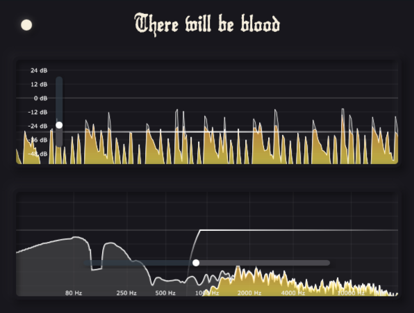

<h1>There will not be blood</h2>

<p align="center"></p>

<p>
    There will not be blood is a dynamics processing plugin.
</p>

### Build from Source
To build There will not be blood from source:

1. **Clone the Repository:**
   ```bash
   git clone https://github.com/Coconut-audio/there-will-not-be-blood.git
   cd there-will-not-be-blood
2. **Install Dependencies:**
   - **Windows:** Make sure you have Visual Studio installed with the necessary components for C++ development.
   - **Mac:** Make sure you have Xcode installed with the command line tools.
3. **Build the Plugin:**

   **Windows:**
   - Open the project in Visual Studio.
   - Set the build configuration to `Release`.
   - Build the project by selecting `Build > Build Solution`.

   **Mac:**
   - Open the project in Xcode.
   - Set the scheme to `Release`.
   - Build the project by selecting `Product > Build`.

## Usage
<iframe src="https://www.linkedin.com/embed/feed/update/urn:li:ugcPost:7280241461164457984?compact=1" height="399" width="710" frameborder="0" allowfullscreen="" title="Embedded post"></iframe>

## Contributing
Contributions to There will not be blood are welcome! If you'd like to contribute, follow these steps:
1. **Fork the Repository:** Start by forking the [There will not be blood](https://github.com/Coconut-audio/there-will-not-be-blood).
2. **Make Changes:** Create a new branch, make your changes, and commit them to your branch.
3. **Create a Pull Request:** Push your changes to your fork and submit a pull request.

<a href="https://www.buymeacoffee.com/vivekvijayan12" target="_blank"></a>

## License
This project is licensed under the GNU General Public License. See the [LICENSE](https://github.com/Coconut-audio/there-will-not-be-blood/blob/main/LICENSE) for details.